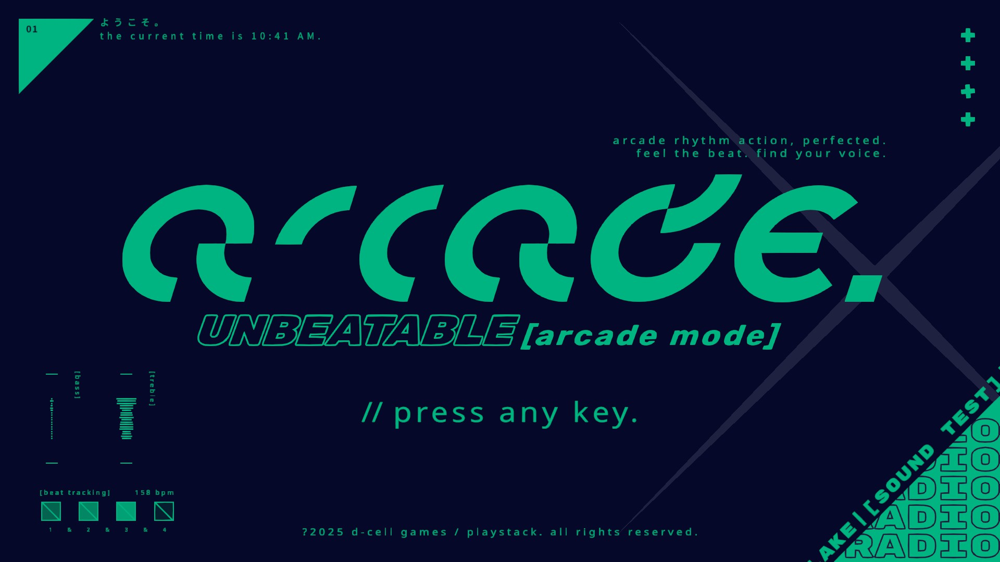

# Arcade Dark Mode

This mod for UNBEATABLE allows you to save your Arcade Dark Mode setting, and also allows you to go back to normal light mode by entering the Konami Code again. This dark mode is in the base game, but doesn't save between relaunches and can't be undone without restarting the game.

## Compatible game versions

- UNBEATABLE Demo (tested with v1.5.28-contentlock)

## Requirements

- [BepInEx](https://github.com/BepInEx/BepInEx)

## Installation

1. Download and install BepInEx into your game directory (if you use [CustomBeatmaps](https://github.com/gold-me/CustomBeatmapsV4), you have this installed already)
2. Run the game, then close it
3. [Download this mod](https://github.com/Zachava96/ArcadeDarkMode/releases)
4. Merge the BepInEx folder from this mod with the BepInEx folder in your game directory
5. Run the game

## Configuration

There's only one option, which is to enable dark mode. You can change this outside the game in the `BepInEx/config/net.zachava.arcadedarkmode.cfg` file by changing the `DarkModeEnabled` setting.

To change between normal light mode and dark mode in-game, enter the Konami Code `(Up, Up, Down, Down, Left, Right, Left, Right, B, A)` in Arcade Mode using your input device. `B` and `A` use your "Back" and "Interact" buttons.